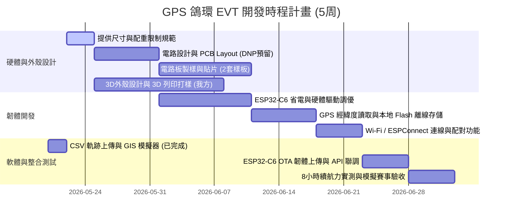

# GPS 鴿環軟/韌/硬體開發時程與驗收指引

本時程表以五周（35天）為基準進行模組化切分，定義雙方配合流程、各階段交付物（軟/硬體/UI）與明確驗收點。

---

## 一、 五周時程詳細進度表 (软/韌/硬體協同流程)

### 第 1 周 (Week 1)：設計規格奠定與 PCB Layout 啟動
*   **硬體端 (代工商)**：
    *   **🔑 關鍵交付**：**在第 3 天前提供第一版物理尺寸規格書**。明確定義 PCB 板寬、板長、厚度（目標：$18 \times 25 \pm 2\text{ mm}$）、螺絲孔或定位卡槽位置，以及精確重量預估（裸板目標 $\le 2\text{g}$，含電池 $130\text{mAh}$ 目標 $\le 5\text{g}$）。
    *   **電路規格**：進行 ESP32-C6、GP-02 定位晶片、微型天線、鋰電池充電電路（含 Type-C 傳輸功能）之電路圖繪製。
*   **軟/韌體端 (我方與協同)**：
    *   定義 ESP32-C6 與後台 API 通訊之 JSON 格式、ESPConnect AP 配對標準與 Wi-Fi 連線下發機制。
*   **我方外殼準備**：
    *   取得代工廠商提供的 PCB 3D 模型檔案（如 `.step` 格式），開始進行 3D 外殼卡扣與防水環設計。

### 第 2 周 (Week 2)：PCB 打樣與外殼 3D 列印打樣
*   **硬體端 (代工商)**：
    *   將 PCB Layout 檔案送廠打樣（2套樣板）、進行鋼網製作與零件採購。
*   **我方外殼準備**：
    *   使用 3D 列印（如光敏樹脂 SLA）打印第一代外殼樣品，驗證物理強度與配戴卡扣。

### 第 3 周 (Week 3)：底層驅動調優與省電模式開發
*   **韌體端 (代工商)**：
    *   收到樣板後，進行硬體首件調試 (Bring-up)，確保 Type-C 充電與通訊、BDS/GPS 訊號鎖定正常。
    *   實作 **ESP32-C6 省電休眠機制**：在 GPS 未鎖定或等待期間自動進入 Deep Sleep / Light Sleep。
    *   實作離線軌跡寫入本地 SPI Flash 儲存功能。

### 第 4 周 (Week 4)：連線與聯調階段 (OTA & ESPConnect)
*   **韌體端 (代工商)**：
    *   整合 **ESPConnect 網路配置協議**，實現手機掃描鴿環 AP 熱點後進入 Web 介面配置 Wi-Fi 的 SSID / 密碼與上報伺服器 IP。
    *   交付 API/SDK 封裝，開放 C++ 原始碼與編譯 BSP（板級支持包）。
*   **軟體與聯調 (我方)**：
    *   將實體鴿環與我方的 `ingest_server.py` 後台進行對接。
    *   測試遠端 OTA 韌體升級功能，確保未來能自主維護韌體。

### 第 5 周 (Week 5)：綜合驗收與續航力壓力測試
*   **軟硬整合驗收 (雙方)**：
    *   將電路板裝入我方 3D 列印外殼中，戴在模擬信鴿（或車輛）上進行「8小時續航力連續記錄與歸返讀出」壓力測試。
    *   驗證斷線重連、本地緩存重傳與軌跡合理性分析功能。

---

## 二、 驗收控制點與防禦性合約條款

### 1. 分段驗收及支付方式 (建議 30 / 40 / 30 比例)

| 階段 | 支付比例 | 支付條件與驗收標準 |
| :--- | :---: | :--- |
| **首期 (訂金)** | **30%** | 合約簽訂，且**代工商交付「實體尺寸詳細規格書 (.step 3D 模型)」及「元器件報價單 (BOM)」**，確認尺寸在 $18 \times 25 \pm 2\text{ mm}$ 內。 |
| **中期 (中期款)** | **40%** | 代工商交付 **2 套功能完整之硬體工程樣板 (PCBA)**，且能用 Type-C 燒錄程式、取得 GPS 經緯度，並證明能在 Wi-Fi 熱點下發送數據至指定後台。 |
| **尾款 (驗收款)** | **30%** | **功能與源碼驗收合格**。2 套樣板在極致省電模式下，達到 **8 小時連續工作（每 n 秒記錄一次）之續航目標**，且交接所有硬體電路圖、PCB Layout、C/C++ 韌體源碼與編譯說明書。 |

---

### 2. 功能不足時的處置：減價驗收與補救條款

為避免外包成品出現「能用但未達最優標」的灰色地帶，建議在合約中加入以下**保障條款**：

*   **⚠️ 續航力未達標之補救與減價條款**：
    *   *目標*：在 $130\text{mAh}$ 鋰電池下，保持每 10 秒記錄一次 GPS，續航時間達 8 小時（總計 2880 個定位點）。
    *   *處置*：若實測續航僅介於 6 至 8 小時之間，代工商需在 10 天內進行韌體代碼調優與省電算法修正（免費）。若限期修正後仍無法達到 8 小時，但已達 6.5 小時以上，**採「減價驗收」方式扣除總金額之 10% ~ 15% 作為補償**；若低於 6 小時則判定為「未達基本實用門檻」，我方有權拒付尾款。
*   **⚠️ 尺寸與重量超標條款**：
    *   若實體 PCBA 裸板尺寸超出 $20 \times 27\text{ mm}$ 或重量超過規範，導致無法裝入合適的鴿環外殼，代工商必須免費重新進行 Layout 並重新打樣，時程延誤由代工商負責。
*   **⚠️ 原始碼與智慧財產權保障**：
    *   尾款支付前，代工商必須將所有代碼（含註解）上傳至我方指定的私有 Git 倉庫，並由我方工程師編譯成功、燒錄至樣板中測試無誤後，方可撥付尾款。

---

## 三、 量產代理與報價機制

1.  **量產一併報價 (預估 1000-3000 組)**：
    *   **非常建議在簽訂 EVT 研發合約時，即要求代工商附帶「1000 組 與 3000 組的預估量產單價 (階梯式報價)」**。
    *   *原因*：代工商在設計電路 (Layout) 時，如果知道未來要量產 3000 組，他們會主動選用「供貨穩定、價格低廉、有量產貼片優勢」的元器件；如果僅當作一次性樣板設計，他們可能會使用昂貴、停產或不易貼片的冷門元件，導致後續量產時必須重新 Layout。
2.  **量產委託與代工定位**：
    *   硬體研發商通常有自己長期合作、品質穩定的 SMT（貼片裝配）工廠，由他們代購料件、進行 SMT 貼片與測試，品質較有保障。
    *   合約中可約定：**「研發完成後，若我方委託其量產，研發費用中的 5000-10000 元人民幣可折抵為後續量產的貨款。」** 這能大幅提高代工商在 EVT 研發階段的配合度與認真程度。
