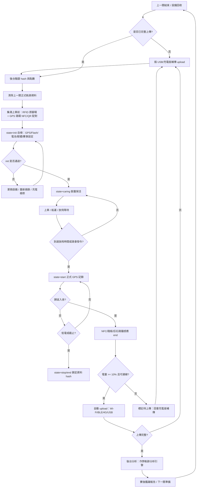
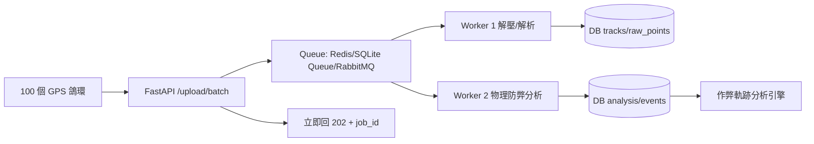

# 安裝 GPS 鴿環手冊

> 版本：v0.3.3 草案  
> 目的：讓 DIY GPS 鴿環到貨後，從連接電腦、燒錄韌體、初始化、賽季各關使用、歸返上傳、下一關重新配對，到壓力測試與未來模組化擴充，都有一份可執行的操作手冊。

---

## 0. 名詞與核心概念

| 名詞 | 說明 |
|---|---|
| GPS 鴿環 | ESP32-C3/C6 + GPS/4G 或 GPS/Wi-Fi/BLE + 電池 + NFC/QR 的腳環設備 |
| NFC 感應 | 歸返或配對時，用手機/踏板/讀卡器感應鴿環，觸發讀取、配對或上傳 |
| ESPConnect / OTA | 透過瀏覽器或 Wi-Fi 介面上傳 `.bin` 韌體，不一定每次都要拆機接 USB |
| `.ino` | Arduino 原始碼，適合工程師修改與追版本 |
| `.bin` | 編譯後韌體，適合量產或現場更新 |
| init | 開機/配對/裝籠前初始化與自檢 |
| caring | 集鴿後到放飛前的保活/看護狀態 |
| start | 放飛到歸返期間的正式 GPS 紀錄狀態 |
| stop/end | 歸返、感應 NFC、低電保護或比賽結束後停止正式紀錄 |
| upload | USB/Wi-Fi/BLE/4G 批次上傳 GPS 軌跡 |

---

## 1. DIY GPS 鴿環到貨後：第一次安裝步驟

### 1.1 準備工具

建議先準備：

1. Windows 11 筆電或桌機。
2. USB Type-C 傳輸線：需支援資料傳輸，不要只有充電功能。
3. Arduino IDE 或 VS Code + PlatformIO。
4. Python 3 與 `esptool.py`。
5. USB-to-UART 驅動：依板子晶片可能是 CH340 / CP210x / USB CDC。
6. GPS 鴿環韌體原始碼 `.ino` 或量產韌體 `.bin`。
7. 後台測試網址：`http://192.168.120.218:8802/index.html` 或正式反代網址。

### 1.2 安裝開發/燒錄環境

#### Arduino IDE 路線

1. 安裝 Arduino IDE。
2. 在 Boards Manager 安裝 `esp32 by Espressif Systems`。
3. 選擇板型：`ESP32C3 Dev Module` 或外包商指定板型。
4. 選擇 COM Port。
5. 開啟 `.ino`，確認腳位設定符合實際硬體：
   - GPS RX/TX
   - GPS 電源控制 GPIO
   - 電池 ADC 腳位
   - NFC/按鍵/防拆腳位
6. 編譯並上傳。

#### PlatformIO 路線（建議量產/工程使用）

1. 安裝 VS Code。
2. 安裝 PlatformIO extension。
3. 打開韌體專案資料夾。
4. 檢查 `platformio.ini`：

```ini
[env:esp32-c3]
platform = espressif32
board = esp32-c3-devkitm-1
framework = arduino
monitor_speed = 115200
```

5. 執行 Build / Upload。
6. 開啟 Serial Monitor，確認輸出 `state=init`。

#### esptool 燒錄 `.bin`

Windows 範例：

```powershell
python -m pip install esptool
python -m esptool --chip esp32c3 --port COM5 --baud 921600 write_flash 0x0 gpsring-v0.3.3-esp32c3.bin
```

Linux 範例：

```bash
python3 -m pip install esptool
python3 -m esptool --chip esp32c3 --port /dev/ttyUSB0 --baud 921600 write_flash 0x0 gpsring-v0.3.3-esp32c3.bin
```

> 若燒錄失敗，先確認 Type-C 線是否有資料傳輸、COM Port 是否正確、是否需要按住 BOOT 鍵再插 USB。

---

### 1.3 v0.3.3 到貨測試：ESPConnect / Win11 / SSH 分工

目前到貨狀態：10 pcs ESP32-C3 測試板已有 9 pcs 到貨；另一片 OLED 版本稍後到貨；GP-02 GPS 模組已到貨。ESPConnect 初測已能辨識 ESP32-C3，代表 USB WebSerial 連線路徑可用。

#### 不想直接動程式碼時的建議路線

1. **只燒錄 `.bin`：不必先安裝 Arduino IDE。** 只要有外包商或工程師提供的 `gpsring-vX.Y.Z-esp32c3.bin`，可用 ESPConnect 或 `esptool.py` 直接燒錄。
2. **需要修改/編譯 `.ino`：才需要 Arduino IDE 或 PlatformIO。** `.ino` 是原始碼，不建議現場人員直接修改；現場測試應以已編譯 `.bin` 為主。
3. **第一次空白板：優先 USB 燒錄。** OTA 需要裝置內已經有支援 OTA 的韌體與分割表；空白板或未確認分割表時，不應直接假設可 Wi-Fi OTA。
4. **ESPConnect WebSerial 控制範圍：** 板子插在 Win11 時，最方便用 Win11 Chrome/Edge 開 `https://espconnect.xdove.win` 操作；板子插在 `192.168.11.216` 時，才適合由 SSH + `esptool.py` 代管燒錄。
5. **燒錄前必問清楚 `.bin` 類型與位址：**
   - full image / factory image：常見從 `0x0` 燒入。
   - app-only image：常見需要依 partition table 從 `0x10000` 或指定 offset 燒入。
   - 若外包商沒有提供 bootloader、partition table、app offset，視為交付不足，先不要大量燒。

#### ESPConnect 初測紀錄（2026-05-30）

| 項目 | 結果 |
|---|---|
| ESPConnect 版本 | v1.1.12 |
| 晶片 | ESP32-C3 QFN32 revision v0.4 |
| Flash | 4MB XMC，Flash ID `0x164046` |
| USB | Espressif Systems - ESP32 Native USB / USB-JTAG Serial |
| MAC | `14:63:93:70:77:b4` |
| 連線 | 已成功 handshake、stub running、Ready to flash |
| 測試 baud | 921600 可連；serial monitor 已切到 115200 |
| 注意 | 日誌顯示 `No plausible partition table entry found`，代表目前板上可能尚無有效應用/分割表；第一次正式韌體請使用完整燒錄包或明確 offset。 |

---

## 2. 第一次開機檢測步驟

### 2.1 Serial Monitor 應看到的資訊

開機後至少應輸出：

```text
state=init
firmware_version=gpsring-v0.3.3
device_id=G0703-xxxxx
battery_pct=xx
gps_fixed=true/false
storage_free=xxxx
upload_status=idle
```

### 2.2 必測項目

| 項目 | 檢測方式 | 合格標準 |
|---|---|---|
| 充電 | 插 USB Type-C | 可充電、電壓上升、無異常發熱 |
| 電池讀值 | Serial / 後台 | `battery_pct` 合理，例如 60–100% |
| GPS 搜星 | 室外 1–5 分鐘 | 能取得 lat/lng、satellites、hdop |
| Flash 儲存 | 模擬記錄 5–10 筆 | 重開機後資料仍存在 |
| NFC/QR | 手機或讀卡器掃描 | 可開啟設備頁或觸發 end/upload |
| Wi-Fi/BLE/USB 上傳 | 上傳測試資料 | 後台可看到軌跡 |
| OTA/ESPConnect | 上傳 `.bin` | 更新後版本號改變 |

---

## 3. 韌體狀態機：init / caring / start / stop / upload

### 3.1 狀態說明

| 狀態 | 觸發條件 | 行為 | 省電策略 | 後台判斷 |
|---|---|---|---|---|
| `init` | 充電開機、配對、重設資料 | 自檢、讀取賽事設定、清空上一關資料、建立 pairing ledger | 可保持 USB 供電 | 顯示初始化成功/失敗 |
| `caring` | 集鴿配對完成到放飛前 | 低頻心跳、檢查是否異常位移、保存電量 | Deep Sleep，約 30–60 分醒一次 | 確認裝籠後未被異常移動 |
| `start` | 放飛時間到或鴿會發令 | 依 n 秒記錄 GPS，預設 300 秒，可依賽距調整 | GPS 定位後立刻睡眠 | 產生正式比賽軌跡 |
| `stop/end` | 歸返感應 NFC、踏板、手機、低電保護、截止時間 | 停止正式紀錄，鎖定資料 hash | 低電時只保留上傳/等待 USB | 後台標記待上傳/已結束 |
| `upload` | NFC end、USB、Wi-Fi、BLE、4G、回會充電 | 批次上傳軌跡，可斷點續傳 | 電量 >10% 可自動傳；低電等待充電 | 後台標記 uploaded / partial / failed |

### 3.2 電量策略

建議規則：

1. `battery_pct >= 10%`：歸返感應 NFC 後可嘗試自動上傳。
2. `battery_pct < 10%`：不強制即時上傳，避免上傳到一半完全斷電；改標記 `upload_pending_low_battery`。
3. 上傳到一半失敗也可接受：後台應保存 partial chunk，回鴿會插電後繼續補傳。
4. 回鴿會充電座時，裝置應自動檢查：
   - 是否已有完整上傳？
   - 軌跡 hash 是否一致？
   - 是否需要補傳缺漏 chunk？

---

## 4. GPS 鴿環賽季各關生命週期流程圖



---

## 5. 正式賽事操作 Loop

### 5.1 每一關集鴿前

1. 確認上一關資料已完整上傳。
2. 後台顯示 `uploaded=true`、`point_count` 與 `track_hash` 正常。
3. 清除上一關資料或移入 sealed archive。
4. 使用 RFID 原腳環 + GPS 鴿環 NFC/QR 重新配對。
5. 寫入本關 `stage_name`：`資格1 / 資格2 / 1關 / 2關...`。
6. 寫入放飛時間、截止時間、鴿舍座標、放飛座標。
7. 進入 `init`，自檢通過後進入 `caring`。

### 5.2 上車/船運/放飛前

1. 裝置大多時間 Deep Sleep。
2. 每 30–60 分鐘醒來保存心跳與簡短位置。
3. 若 caring 期間出現異常位移、拆卸、低電，後台標示 `caring_alert`。
4. 到放飛時間或收到鴿會發令後進入 `start`。

### 5.3 比賽中

1. 預設每 300 秒記錄一筆 GPS，符合 8 小時續航目標。
2. 高價版或短距離關可改 10/30/60 秒。
3. 異常滯留、疑似擄鴿或停留過久，可短時間提高採樣頻率。
4. 4G 版可事件式回報，不必全程即時上傳。

### 5.4 歸返時

1. 進巢踏板、巨石鴿鐘、NFC 或手機感應觸發 `end`。
2. 裝置進入 `stop/end`，停止正式軌跡，鎖定 hash。
3. 若電量 >=10% 且有 Wi-Fi/BLE/4G，可自動上傳。
4. 若上傳中斷，不視為失敗；後台標示 partial，回會補傳即可。
5. 若完全無電，回會插充電座後自動 resume upload。

---

## 6. 壓力測試規格：100 台 1 分鐘內歸返上傳

### 6.1 預設壓測情境

| 參數 | 預設值 |
|---|---:|
| GPS 鴿環數量 n | 100 |
| 歸返集中時間 | 1 分鐘 |
| 每台點數 | 8 小時 / 300 秒 = 96 點；高頻 10 秒 = 2880 點 |
| 上傳格式 | gzip JSON 或 CSV |
| 後台目標 | 接收、落地暫存、回傳 job_id，不在 API request 內做重 CPU 分析 |

### 6.2 測試觀察指標

1. 總耗時：100 台是否能在 1 分鐘內全部收到 `202 Accepted`。
2. CPU：API process、背景 worker、DB process 分別觀察。
3. RAM：上傳尖峰是否造成記憶體暴增。
4. HDD/SSD I/O：暫存檔與 DB 寫入是否造成 iowait。
5. DB lock：SQLite fallback 是否鎖住；正式環境應用 PostgreSQL/MariaDB + queue。
6. API p95 latency：建議 200–500ms 內回應接收成功。
7. 完整分析時間：接收後背景分析可慢，但要有 job progress。

### 6.3 建議架構



---

## 7. 未來模組化擴充：GPS 鴿環 → 工程車 / 車隊 / 共享定位平台

GPS 鴿環後台應預留成「位置資料平台」，防弊只是其中一個 domain module。

### 7.1 模組分類

| 模組 | GPS 鴿環 | 工程車/車隊 |
|---|---|---|
| 定位上傳 | 必要 | 必要 |
| 軌跡地圖 | 必要 | 必要 |
| 防弊判定 | 必要 | 通常不需要 |
| 即時位置 | 可選，4G 版才強 | 必要 |
| QR/NFC 配對 | 必要 | 可用 QR 免登入分組 |
| 權限/群組 | 鴿會/賽事/鴿主 | 公司/工地/車隊/專案 |
| 電源 | 電池嚴格省電 | 車上插電，較寬鬆 |

### 7.2 預留設計

1. `device_type`：`gpsring`、`truck`、`fleet`、`asset`。
2. `tenant/group`：不同鴿會、工地、公司分群。
3. `feature_flags`：是否啟用 anti_fraud、realtime、public_share、report。
4. QR Code 免登入：掃 QR 後只看該 group 或該設備的簡易地圖。
5. 權限分層：管理員、裁判/會長、鴿主、工程車調度、公開只讀。

> 建議：先把 GPSRing 完善，工程車/車隊等應用只做資料模型與 API 預留，不要現在展開，以免系統變大失焦。

---

## 8. 下一步建議

1. 先完成 DIY 到貨實測：確認 USB、GPS、電池、Flash、NFC、上傳都能跑通。
2. 建立最小韌體樣板：`init/caring/start/stop/upload` 狀態機 + NVS/LittleFS 快取。
3. 建立壓測腳本：先模擬 n=100、一分鐘內上傳；再擴到 500。
4. 後台改成 job/queue 模型：API 快速接收，背景慢慢分析。
5. UI 下一版做「賽後鑑識報告」與「設備上傳狀態看板」。
6. 等 GPSRing 主線穩定後，再另開工程車/車隊平台化應用。

---

## 9. 實機到貨前測試任務清單（2026-05-30 新階段）

### Phase 1：硬體清點與 USB 連線

- [x] 9/10 pcs ESP32-C3 SuperMini 測試板到貨。
- [x] GP-02 GPS 模組到貨。
- [ ] OLED 版本測試板到貨後補測螢幕、I2C 腳位與耗電。
- [x] ESPConnect 可辨識 ESP32-C3 與 4MB Flash。
- [ ] 對 9 片板逐一貼上臨時 device_id，記錄 MAC、Flash ID、是否可進 bootloader。

### Phase 2：韌體初步測試（不直接改程式碼）

- [ ] 向外包商/工程端取得完整交付包：`.ino`/source、PlatformIO/ESP-IDF 設定、`.bin`、bootloader、partition table、燒錄 offset、NVS 初始化格式。
- [ ] 先選 1 片非 OLED 板做 USB 燒錄 smoke test。
- [ ] Serial Monitor 確認 `firmware_version`、`state=init`、`device_id`、Flash free、battery/gps 欄位。
- [ ] 接上 GP-02，在室外測 `$GNRMC/$GNGGA` 與 `gps_fixed=true`。

### Phase 3：OTA 驗證

- [ ] 第一版韌體必須內建 OTA 或 Web update endpoint，並回報 `build_hash`。
- [ ] 先用 USB 燒入 OTA-enabled factory 韌體。
- [ ] 再用 OTA 上傳小版本 `.bin`，確認版本號由 `v0.3.3-test1` 變成 `v0.3.3-test2`。
- [ ] OTA 失敗時需能回滾或保留上一版可開機韌體；測試前不要一次刷 9 片。

### Phase 4：後台與壓測 API

- [ ] 既有 API：`POST /api/v1/devices/config`、`POST /api/v1/tracks/ingest`、`POST /api/v1/tracks/upload/csv` 可供 POC。
- [ ] 新增規劃 API：`POST /api/v1/tracks/upload/batch`，接收 gzip JSON/CSV，立即回 `202 + job_id`。
- [ ] 背景 worker 寫入 raw points，再跑 segment/event analysis。
- [ ] 壓測先跑 n=100 / 1 分鐘集中上傳，觀察 p95 latency、CPU/RAM/I/O/DB lock。

### Phase 5：服務啟動與通知

- [x] `start88` / `check8802` 已同步到 `~/.local/bin`。
- [x] 已加入 crontab `@reboot`，重開機後 10 秒自動執行 `start88`，log：`/tmp/gpsring-start88-boot.log`。
- [ ] 若未來要更正式，可改為 systemd service + healthcheck timer。
- [x] 完成階段成果後，以 `https://ntfy.xdove.win/hermes218` 發送彙整通知。
